# MonitaQC — AI-Powered Quality Control Platform

> **See Every Defect. Eject Every Reject. Automatically.**

---

## The Problem

Manual quality inspection is slow, inconsistent, and expensive. Human inspectors miss defects when fatigued, can't keep up with high-speed production lines, and provide no data for process improvement.


## The Solution

MonitaQC replaces manual inspection with **AI-powered computer vision** — detecting defects in milliseconds, ejecting rejects automatically, and providing real-time analytics for continuous improvement.


---

## How It Works

### 1. Capture → 2. Detect → 3. Evaluate → 4. Act

```mermaid
flowchart LR
    CAM["📷 Cameras\n(USB + IP)"] --> VE["🧠 Vision Engine\nImage Processing"]
    VE --> YOLO["🤖 AI Models\nYOLO / Gradio"]
    YOLO --> RULES["📋 Ejection Rules\nCount · Area · Color"]
    RULES -->|NG| EJECT["⚡ Ejector\nAuto-Reject"]
    RULES -->|OK| PASS["✅ Pass"]
    VE --> DB["📊 Database\nTimescaleDB"]
    DB --> DASH["📈 Dashboard\nGrafana Charts"]

    style CAM fill:#3b82f6,color:#fff
    style VE fill:#8b5cf6,color:#fff
    style YOLO fill:#f59e0b,color:#000
    style RULES fill:#ec4899,color:#fff
    style EJECT fill:#ef4444,color:#fff
    style PASS fill:#22c55e,color:#fff
    style DB fill:#06b6d4,color:#fff
    style DASH fill:#10b981,color:#fff
```

---

## Key Features

### Multi-Camera Vision System

Connect unlimited cameras — USB webcams and IP cameras (Hikvision, Dahua, Axis, etc.) — all managed from a single interface.


**Features:**
- Auto-detect USB cameras on startup
- Scan network subnets to discover IP cameras
- Per-camera settings: FPS, resolution, exposure, gain, ROI
- Multi-phase capture states with configurable lighting, delays, and triggers
- Encoder-based and analog sensor-based capture triggers

---

### AI-Powered Detection Pipeline

Chain multiple AI models in sequence for sophisticated multi-stage inspection.


**Supported Inference Backends:**

| Backend | Best For | Models |
|---------|----------|--------|
| **Local YOLO** | On-device, real-time | YOLOv5, v7, v8, v9 |
| **Gradio Remote** | Cloud models, HuggingFace | Any Gradio-wrapped model |

**Key Capabilities:**
- Upload custom `.pt` weight files via web UI
- Hot-swap models without restarting
- Auto-tuned GPU workers based on available VRAM
- Multi-GPU support with automatic load balancing

---

### 7 Ejection Condition Types

Define precise rules for when products should be rejected.

```mermaid
graph TD
    DET["Detection Results"] --> PROC["Ejection Procedure"]

    PROC --> C1["Count =\nExactly N objects"]
    PROC --> C2["Count >\nMore than N"]
    PROC --> C3["Count <\nFewer than N"]
    PROC --> C4["Area >\nObject too large"]
    PROC --> C5["Area <\nObject too small"]
    PROC --> C6["Area =\nExact size match"]
    PROC --> C7["Color ΔE >\nColor deviation"]

    C1 --> LOGIC{AND / OR}
    C2 --> LOGIC
    C3 --> LOGIC
    C4 --> LOGIC
    C5 --> LOGIC
    C6 --> LOGIC
    C7 --> LOGIC

    LOGIC -->|Triggered| EJECT["⚡ EJECT"]
    LOGIC -->|Pass| OK["✅ OK"]

    style C7 fill:#ec4899,color:#fff
    style EJECT fill:#ef4444,color:#fff
    style OK fill:#22c55e,color:#fff
```

**Procedure Configuration:**
- Name each procedure for easy identification
- Combine rules with AND (all must match) or OR (any triggers)
- Restrict procedures to specific cameras
- Set minimum detection confidence per rule
- Enable/disable procedures without deleting them

---

### Color Quality Control (CIE ΔE)

Detect color drift over time using industry-standard CIE L\*a\*b\* color comparison.


| ΔE Value | Perception | Example |
|----------|-----------|---------|
| < 1 | Imperceptible | Same batch, no variation |
| 1 - 2 | Barely noticeable | Acceptable tolerance |
| 2 - 3.5 | Noticeable to trained eye | Minor batch variation |
| 3.5 - 5 | Clearly noticeable | Production issue |
| > 5 | **Significantly different** | **Reject** |

**Use Case:** Textile manufacturers monitoring fabric color consistency across production runs.

---

## System Architecture

```mermaid
graph TB
    subgraph "Hardware Layer"
        CAM["📷 Cameras\n(USB / IP / RTSP)"]
        SER["🔌 Serial Port\n(Arduino / PLC)"]
        BAR["📱 Barcode Scanner\n(USB HID)"]
        ENC["⚙️ Encoder\n(Conveyor Position)"]
    end

    subgraph "MonitaQC Platform (Docker)"
        VE["🧠 Vision Engine\nFastAPI · Python 3.10\nPort 80"]
        YOLO["🤖 YOLO Inference\nPyTorch · GPU\nAuto-Scaled Replicas"]
        REDIS["💾 Redis\nCache & Message Queue\nAuto-Tuned Memory"]
        TSDB["📊 TimescaleDB\nPostgreSQL 15\nTime-Series Storage"]
        GRAF["📈 Grafana\nMetrics Dashboard\nPort 3000"]
        GAL["🖼️ PiGallery2\nImage Browser\nPort 5000"]
    end

    subgraph "Output"
        EJECT["⚡ Ejector\nPneumatic Valve"]
        LIGHT["💡 Lighting\nPWM Control"]
        ALARM["🔊 Audio Alert\nVoice + Beep"]
        DASH["🖥️ Dashboard\nReal-Time Web UI"]
    end

    CAM --> VE
    SER <--> VE
    BAR --> VE
    ENC --> VE
    VE <--> YOLO
    VE <--> REDIS
    VE --> TSDB
    TSDB --> GRAF
    VE --> GAL
    VE --> EJECT
    VE --> LIGHT
    VE --> ALARM
    VE --> DASH

    style VE fill:#8b5cf6,color:#fff
    style YOLO fill:#f59e0b,color:#000
    style REDIS fill:#ef4444,color:#fff
    style TSDB fill:#3b82f6,color:#fff
    style GRAF fill:#10b981,color:#fff
```

---

## Setup in 3 Steps

```mermaid
flowchart LR
    S1["1️⃣ Install\n./start.sh\nAuto-detects hardware"] --> S2["2️⃣ Configure\nWeb UI at :80\nCameras, models, rules"] --> S3["3️⃣ Produce\nReal-time QC\nAutomatic ejection"]

    style S1 fill:#3b82f6,color:#fff
    style S2 fill:#8b5cf6,color:#fff
    style S3 fill:#22c55e,color:#fff
```

### Step 1: Install

```bash
git clone <repository-url>
cd monitaqc
./start.sh        # Linux
start.bat          # Windows
```

`start.py` automatically:
- Detects OS, CPU cores, RAM
- Detects GPU count and VRAM
- Calculates optimal YOLO workers and replicas
- Configures shared memory and Redis
- Launches all 6 services

### Step 2: Configure via Web UI

Open `http://<server-ip>` and configure:

1. **Cameras** — connect USB or discover IP cameras
2. **Inference** — upload YOLO weights or connect Gradio endpoint
3. **Process** — create ejection procedures with rules
4. **Hardware** — configure serial port, ejector timing, lighting

### Step 3: Start Production

Click **Start** — MonitaQC begins capturing, detecting, and ejecting automatically.

---

## Sample Use Cases

### Case 1: Textile Color Inspection

**Industry:** Garment manufacturing
**Challenge:** Fabric color drifts during dyeing process; jeans from different batches look different

```mermaid
flowchart LR
    JEAN["🧥 Jean\non Conveyor"] --> CAM["📷 Camera\nCaptures Image"]
    CAM --> YOLO["🤖 YOLO\nDetects 'jean'"]
    YOLO --> COLOR["🎨 Color ΔE\nvs Running Avg"]
    COLOR -->|ΔE > 5| EJECT["❌ Eject\nColor Drift"]
    COLOR -->|ΔE ≤ 5| PASS["✅ Pass"]

    style EJECT fill:#ef4444,color:#fff
    style PASS fill:#22c55e,color:#fff
```

**Configuration:**
- Procedure: "Color QC"
- Rule: `jean` → Color ΔE > 5.0, vs Running Average
- Min confidence: 40%
- Result: Products with color drift > 5 ΔE are automatically rejected

---

### Case 2: Packaging Completeness Check

**Industry:** Consumer goods packaging
**Challenge:** Ensure every package contains the required label, product, and seal

```mermaid
flowchart LR
    PKG["📦 Package\non Line"] --> CAM["📷 Camera"]
    CAM --> YOLO["🤖 YOLO\nDetects Objects"]
    YOLO --> R1{"Label\nCount ≥ 1?"}
    YOLO --> R2{"Product\nCount = 1?"}
    YOLO --> R3{"Seal\nCount ≥ 1?"}
    R1 -->|Missing| EJECT["❌ Eject"]
    R2 -->|Wrong Count| EJECT
    R3 -->|Missing| EJECT
    R1 -->|OK| CHECK["✅"]
    R2 -->|OK| CHECK
    R3 -->|OK| CHECK

    style EJECT fill:#ef4444,color:#fff
    style CHECK fill:#22c55e,color:#fff
```

**Configuration:**
- Procedure: "Completeness Check" (Logic: ALL)
- Rule 1: `label` → Count > 0
- Rule 2: `product` → Count = 1
- Rule 3: `seal` → Count > 0
- Result: Only complete packages pass

---

### Case 3: Size Anomaly Detection

**Industry:** Precision manufacturing
**Challenge:** Detect undersized or oversized parts before assembly

```mermaid
flowchart LR
    PART["⚙️ Part\non Conveyor"] --> CAM["📷 Camera"]
    CAM --> YOLO["🤖 YOLO\nDetects 'part'"]
    YOLO --> SIZE{"Area Check"}
    SIZE -->|Area < 5000px| SMALL["❌ Too Small"]
    SIZE -->|Area > 50000px| LARGE["❌ Too Large"]
    SIZE -->|5000 ≤ Area ≤ 50000| OK["✅ Pass"]

    style SMALL fill:#ef4444,color:#fff
    style LARGE fill:#ef4444,color:#fff
    style OK fill:#22c55e,color:#fff
```

**Configuration:**
- Procedure: "Size QC" (Logic: ANY)
- Rule 1: `part` → Area < 5000
- Rule 2: `part` → Area > 50000
- Result: Parts outside acceptable size range are ejected

---

### Case 4: Multi-Camera Multi-Model Pipeline

**Industry:** Electronics assembly
**Challenge:** Different cameras inspect different aspects of the same product

```mermaid
flowchart TD
    subgraph "Camera 1: Top View"
        C1["📷 Camera 1"] --> M1["🤖 YOLO\nComponent Detection"]
        M1 --> P1["Procedure 1\nCams: 1\nCheck: component count"]
    end

    subgraph "Camera 2: Side View"
        C2["📷 Camera 2"] --> M2["🤖 YOLO\nSurface Defects"]
        M2 --> P2["Procedure 2\nCams: 2\nCheck: defect count = 0"]
    end

    subgraph "Camera 3: Color Station"
        C3["📷 Camera 3"] --> M3["🎨 Color ΔE\nColor Verification"]
        M3 --> P3["Procedure 3\nCams: 3\nCheck: ΔE < 3"]
    end

    P1 --> DECISION{Any NG?}
    P2 --> DECISION
    P3 --> DECISION
    DECISION -->|Yes| EJECT["⚡ Eject"]
    DECISION -->|No| PASS["✅ Ship"]

    style EJECT fill:#ef4444,color:#fff
    style PASS fill:#22c55e,color:#fff
```

---

### Case 5: DataMatrix Barcode Verification

**Industry:** Pharmaceutical / Logistics
**Challenge:** Every product must have a readable DataMatrix code matching the expected pattern

```mermaid
flowchart LR
    PROD["💊 Product"] --> CAM["📷 Camera"]
    CAM --> DM["📱 DataMatrix\nDecoder"]
    DM --> MATCH{"Code Matches\nExpected Pattern?"}
    MATCH -->|No Match| EJECT["❌ Eject\nInvalid Code"]
    MATCH -->|Match| VERIFY["✅ Verified\nLogged to DB"]

    style EJECT fill:#ef4444,color:#fff
    style VERIFY fill:#22c55e,color:#fff
```

---

## Real-Time Dashboard

```
┌─────────────────────────────────────────────────────────────────┐
│  MonitaQC v3.10                              [EN ▼] [💾 Save]  │
│                                                                  │
│  ┌──────────┐  ┌──────────┐  ┌──────────┐  ┌──────────────┐   │
│  │ Encoder  │  │  Speed   │  │   FPS    │  │ Queue: 0     │   │
│  │  12,450  │  │ 120 PPM  │  │  28.3    │  │ ████░░░░ 12% │   │
│  └──────────┘  └──────────┘  └──────────┘  └──────────────┘   │
│                                                                  │
│  ┌─────────────┐  ┌─────────────┐  ┌────────────────────────┐ │
│  │   ✅ OK     │  │   ❌ NG     │  │  Ejector: ACTIVE      │ │
│  │   1,247     │  │      23     │  │  Offset: 500 pulses   │ │
│  │   98.2%     │  │    1.8%     │  │  Duration: 0.3s       │ │
│  └─────────────┘  └─────────────┘  └────────────────────────┘ │
│                                                                  │
│  ┌─────────────────────────────────────────────────────────┐   │
│  │ Timeline                              [◀ Prev] [Next ▶] │   │
│  │ ┌─────┐ ┌─────┐ ┌─────┐ ┌─────┐ ┌─────┐ ┌─────┐      │   │
│  │ │ ✅  │ │ ✅  │ │ ❌  │ │ ✅  │ │ ✅  │ │ ✅  │      │   │
│  │ │cam1 │ │cam2 │ │cam1 │ │cam1 │ │cam2 │ │cam1 │      │   │
│  │ └─────┘ └─────┘ └─────┘ └─────┘ └─────┘ └─────┘      │   │
│  └─────────────────────────────────────────────────────────┘   │
└─────────────────────────────────────────────────────────────────┘
```

---

## Supported Industries

| Industry | Use Case | Key Features Used |
|----------|----------|-------------------|
| **Textile & Garment** | Color consistency, defect detection | Color ΔE, multi-camera |
| **Food & Beverage** | Label presence, fill level | Count rules, area rules |
| **Pharmaceutical** | DataMatrix verification, packaging | DM decoder, count rules |
| **Electronics** | Component placement, solder inspection | Multi-model pipeline, area |
| **Automotive** | Part presence, size verification | Count + area rules |
| **Packaging** | Completeness, seal integrity | Multi-rule procedures |
| **Printing** | Color accuracy, registration | Color ΔE (fixed reference) |

---

## Technical Specifications

### Software

| Component | Technology |
|-----------|-----------|
| Backend | Python 3.10, FastAPI |
| AI Engine | YOLOv5/v7/v8/v9 (PyTorch), Gradio |
| Database | TimescaleDB (PostgreSQL 15) |
| Cache | Redis 7 (Alpine) |
| Analytics | Grafana |
| Image Gallery | PiGallery2 |
| Containerization | Docker Compose |
| Languages | 7 (EN, FA, AR, DE, TR, JA, ES) |

### Hardware Requirements

| Requirement | Minimum | Recommended |
|-------------|---------|-------------|
| CPU | 4 cores | 8+ cores |
| RAM | 8 GB | 16+ GB |
| GPU | - | NVIDIA with 4+ GB VRAM |
| Storage | 256 GB SSD | 1+ TB SSD |
| Cameras | 1 USB | Multiple USB + IP |
| Network | 100 Mbps | 1 Gbps (for IP cameras) |

### Performance

| Metric | Typical Value |
|--------|---------------|
| Detection latency | < 50ms per frame |
| Throughput (GPU) | 30-90+ FPS |
| Throughput (CPU) | 5-15 FPS |
| Camera support | Unlimited |
| Concurrent models | Multiple (pipeline) |

---

## Why MonitaQC?

```mermaid
graph TD
    subgraph "Before MonitaQC"
        B1["👤 Manual Inspection"]
        B2["15-25% Miss Rate"]
        B3["No Data / No Analytics"]
        B4["High Labor Cost"]
        B5["Inconsistent Quality"]
    end

    subgraph "After MonitaQC"
        A1["🤖 AI Inspection"]
        A2["< 2% Miss Rate"]
        A3["Full Production Analytics"]
        A4["ROI in 3-6 Months"]
        A5["Consistent 24/7 Quality"]
    end

    B1 -.->|Replace| A1
    B2 -.->|Improve| A2
    B3 -.->|Add| A3
    B4 -.->|Reduce| A4
    B5 -.->|Guarantee| A5

    style B1 fill:#ef4444,color:#fff
    style B2 fill:#ef4444,color:#fff
    style B3 fill:#ef4444,color:#fff
    style B4 fill:#ef4444,color:#fff
    style B5 fill:#ef4444,color:#fff
    style A1 fill:#22c55e,color:#fff
    style A2 fill:#22c55e,color:#fff
    style A3 fill:#22c55e,color:#fff
    style A4 fill:#22c55e,color:#fff
    style A5 fill:#22c55e,color:#fff
```

| Feature | Manual QC | MonitaQC |
|---------|----------|----------|
| Speed | 1-2 items/sec | 30-90+ items/sec |
| Consistency | Varies with fatigue | 24/7 identical accuracy |
| Data | None | Full production analytics |
| Color detection | Subjective | Objective (CIE ΔE) |
| Multi-criteria | Difficult | 7 condition types |
| Cost trend | Increases with scale | Fixed after deployment |
| Setup time | Weeks of training | Hours to configure |

---

## Deployment Options

```mermaid
graph LR
    subgraph "On-Premise (Recommended)"
        OP["🏭 Factory Server\nDocker Compose\nFull control"]
    end

    subgraph "Air-Gapped"
        AG["🔒 Offline Server\nPre-packed images\nNo internet required"]
    end

    subgraph "Cloud-Hybrid"
        CH["☁️ Cloud Inference\nGradio endpoints\nLocal capture"]
    end

    style OP fill:#22c55e,color:#fff
    style AG fill:#3b82f6,color:#fff
    style CH fill:#8b5cf6,color:#fff
```

---

## Getting Started

Contact us for a demo, pilot installation, or custom model training:

**Smart Falcon AI**
- Web: [smartfalcon-ai.com](https://smartfalcon-ai.com)
- Email: [admin@smartfalcon-ai.com](mailto:admin@smartfalcon-ai.com)
- AI Model Training: [ai-trainer.monitait.com](https://ai-trainer.monitait.com)

---

*MonitaQC v3.10.0 — Built for production. Designed for quality.*
