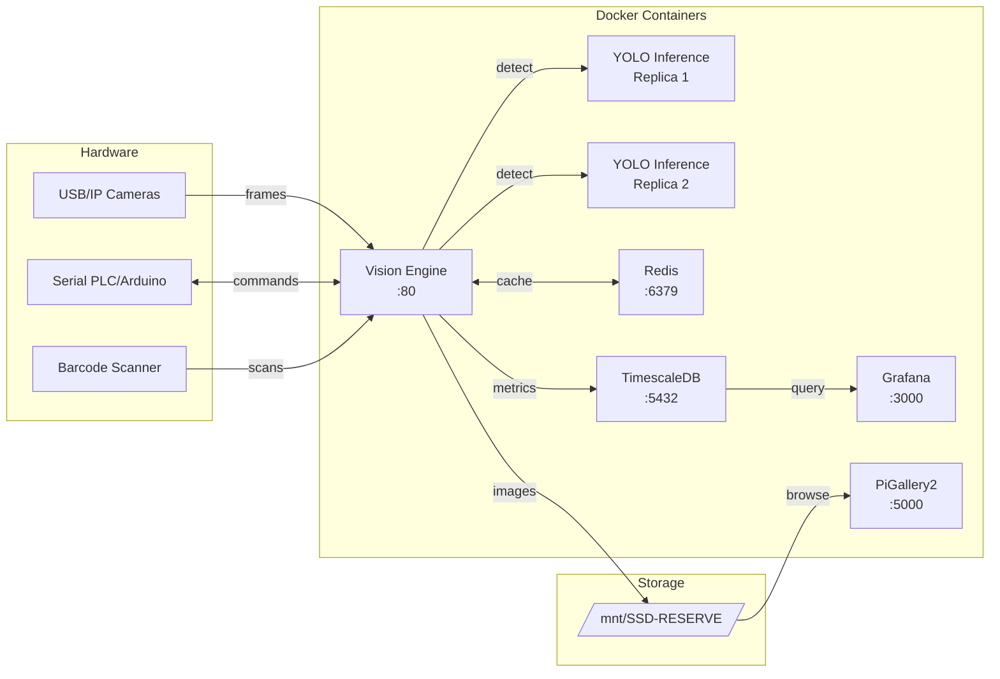

# MonitaQC - Universal Quality Control Platform

**Version:** 3.5.0 | **Status:** Production-Ready | **Documentation:** [How-To Guide](HOW-TO.md) | [User Manual](USER_MANUAL.md) | [Audit Report](AUDIT_REPORT.md)

**MonitaQC** is an industrial computer vision platform for automated quality control and product identification. Forked from PartQC Box Vision Engine, this project is the foundation for a unified quality control system.

## Overview

MonitaQC combines advanced image processing, object detection, and hardware integration to provide real-time quality inspection capabilities for manufacturing and fulfillment operations.

### Lightweight by Design

MonitaQC features a **streamlined architecture** with only essential services:
- **7 containers** covering vision, AI inference, database, caching, and monitoring
- **Minimal memory footprint** with optimized Redis (auto-tuned)
- **Reduced logging** overhead (5-10MB max per service)
- **Auto-tuned resources** based on detected CPU, RAM, and GPU

### Key Features

- **Multi-Camera Vision System**: Unlimited cameras with auto-detection (USB + IP cameras)
  - USB cameras auto-detected via V4L2
  - IP cameras via RTSP/HTTP (Hikvision, Dahua, Axis, etc.)
  - Mix and match USB and network cameras
- **AI-Powered Detection**: YOLOv5-based object detection with custom model support
- **DataMatrix Recognition**: Advanced barcode decoding with multi-stage preprocessing
- **OCR Capabilities**: Text recognition using EasyOCR
- **Object Nesting Detection**: Hierarchical parent-child object relationships
- **Real-Time Streaming**: Live MJPEG video feed on status page
- **Hardware Integration**: Serial communication, barcode scanners, GPIO control
- **Shipment Tracking**: Django-based fulfillment management system
- **Ejector Control**: Automated defect rejection system
- **Multi-Language Support**: English and Persian/Farsi

## Architecture



MonitaQC uses a microservices architecture:

```
MonitaQC/
├── vision_engine/             # Core QC processing engine
│   ├── main.py                #   FastAPI app entrypoint
│   ├── config.py              #   Configuration & startup
│   ├── routers/               #   API route handlers
│   │   ├── ai.py              #   AI provider config
│   │   ├── cameras.py         #   Camera management
│   │   ├── health.py          #   Health checks
│   │   ├── inference.py       #   Detection pipeline
│   │   ├── timeline.py        #   Timeline & history
│   │   └── websocket.py       #   Real-time updates
│   ├── services/              #   Business logic
│   │   ├── camera.py          #   Camera capture
│   │   ├── db.py              #   TimescaleDB client
│   │   ├── detection.py       #   Detection processing
│   │   ├── pipeline.py        #   Pipeline management
│   │   ├── state_machine.py   #   Multi-phase states
│   │   └── watcher.py         #   Serial & capture orchestration
│   └── static/                #   Web UI (status page)
├── yolo_inference/            # YOLO AI inference service
├── timescaledb/               # Database init scripts
├── deploy/                    # Offline deployment scripts
├── start.py                   # Auto-detect OS/hardware & launch
├── start.sh                   # Linux launcher (calls start.py)
├── start.bat                  # Windows launcher (calls start.py)
└── docker-compose.yml         # Service orchestration
```

## Getting Started

### Prerequisites

- Docker & Docker Compose
- Python 3 (for the startup script)
- NVIDIA GPU + NVIDIA Container Toolkit (for YOLO inference)
- Optional: USB cameras, serial device (Arduino/PLC), barcode scanner

### Quick Start (New Server)

1. **Clone the repository:**
   ```bash
   git clone http://gitlab.virasad.ir/monitait/monitaqc.git
   cd monitaqc
   ```

2. **Load AI weights:**
   Train your model at [ai-trainer.monitait.com](https://ai-trainer.monitait.com), then place `best.pt` in `volumes/weights/best.pt`.

3. **Start the application:**
   ```bash
   # Linux
   ./start.sh

   # Windows
   start.bat
   ```

   `start.py` will automatically:
   - Detect OS (Linux → production mode, Windows → dev mode)
   - Detect hardware (CPU cores, RAM, GPUs)
   - Auto-tune YOLO replicas/workers, shared memory, Redis memory
   - Set `PRIVILEGED=true` on Linux for device access (serial, cameras, barcode scanner)
   - Set `DATA_ROOT=/mnt/SSD-RESERVE` on Linux (`.` on Windows)
   - Write `.env` and run `docker compose up -d`

4. **Open the web interface:** `http://<server-ip>`

   All configuration (cameras, inference, serial, ejector, capture settings, etc.)
   is done via the web interface and persisted to `.env.prepared_query_data`.

### Manual Start (Advanced)

If you prefer to configure manually instead of using `start.py`:

```bash
# Create .env file
cat > .env << EOF
DATA_ROOT=/mnt/SSD-RESERVE
PRIVILEGED=true
YOLO_REPLICAS=2
YOLO_WORKERS=2
SHM_SIZE=2g
REDIS_MAXMEMORY=256
EOF

# Build and run
docker compose up -d
```

### Offline Deployment

For air-gapped servers, use the deployment scripts in `deploy/`:

```bash
# On a machine with internet: pack images
./deploy/pack.sh

# On the target server: install from pack
./deploy/install.sh
```

## Configuration

All settings are configured via the **web interface** at `http://<server-ip>/status` and saved to `.env.prepared_query_data` for persistence across restarts. Click **"Save All Configuration"** in the top-right to persist changes.

### Step-by-Step Setup Guide

After starting the application for the first time, configure it in this order:

#### 1. Connect Cameras (Cameras Tab)

**USB cameras** are auto-detected on startup. For **IP cameras**:

1. Go to the **Cameras** tab
2. Enter your network subnet (e.g., `192.168.0`) and click **Scan**
3. Discovered cameras will appear — click **Save** to add them
4. Adjust per-camera settings: FPS, resolution, exposure, gain, brightness, contrast, saturation
5. Optionally set **ROI (Region of Interest)** to crop to a specific area

#### 2. Configure Capture States (Cameras Tab → States)

States define **how** the system captures images using multi-phase lighting:

1. Scroll to **State Management** in the Cameras tab
2. Create a state with one or more **phases**, each defining:
   - **Light Mode**: `U_ON_B_OFF` (uplight), `B_ON_U_OFF` (backlight), `U_ON_B_ON` (both), `U_OFF_B_OFF` (off)
   - **Delay**: seconds to wait after setting lights before capturing
   - **Cameras**: which camera IDs to capture in this phase (comma-separated)
   - **Steps**: capture every N encoder pulses (`-1` = continuous loop)
   - **Analog Threshold**: analog sensor trigger value (`-1` = disabled)
3. Set the **active state** for production

#### 3. Set Up Inference Pipeline (Inference Tab)

Define what AI model processes the captured images:

**Single model:**
1. Go to the **Inference** tab
2. Select the inference module: `Local YOLO` or `Gradio HuggingFace`
3. Set the **inference URL** (e.g., `http://yolo_inference:4442/v1/object-detection/yolov5s/detect/`)
4. Choose the **model** and set **confidence threshold**

**Multi-model pipeline:**
1. Create multiple **models** (e.g., one YOLO for defect detection, one Gradio for classification)
2. Create a **pipeline** with ordered phases, each referencing a model
3. **Activate** the pipeline — frames will pass through each model in sequence

**Upload custom weights:**
1. Train your model at [ai-trainer.monitait.com](https://ai-trainer.monitait.com)
2. Upload the `.pt` file via the **Upload Weights** button
3. Click **Activate Weights** to load on all YOLO replicas

#### 4. Configure the Ejector (Hardware Tab)

Set up automatic rejection of defective items:

1. Go to the **Hardware** tab → **Ejector Configuration**
2. Enable the ejector toggle
3. Set **Ejector Offset**: encoder counts from camera position to ejector position
4. Set **Ejector Duration**: how long to activate the ejector (seconds)
5. Define **OK** and **NG** parameters:
   - **Offset Delay** (ms): timing between capture and trigger
   - **Duration Pulses**: output pulse length (16μs units)
   - **Encoder Factor**: scaling multiplier
6. Optionally configure **Class Count Check** to validate expected object counts

#### 5. Configure Serial Communication (Hardware Tab)

Connect to Arduino/PLC for hardware control:

1. Go to **Hardware** tab → **Serial Port Configuration**
2. Set **Device Path** (e.g., `/dev/ttyUSB0`)
3. Set **Baud Rate** (typically `57600`)
4. Choose **Serial Mode**: `new` (recommended) or `legacy`
5. Use the **Light Controls** to verify communication:
   - Both On / U On, B Off / B On, U Off / Both Off
   - Set PWM values (0-255) for fine brightness control

#### 6. Set Up Image Processing (Cameras Tab)

Configure how detected objects are processed:

1. **Parent Object List**: enforce parent-child relationships (e.g., a "box" must contain a "logo")
2. **DataMatrix Settings**: valid character sizes, confidence/overlap thresholds
3. **Histogram**: enable for quality distribution analysis
4. **Store Annotations**: save detection results to TimescaleDB

#### 7. View Results on Dashboard

The **Dashboard** tab shows real-time results:

- **Left column**: encoder, speed, counters (OK/NG), ejector status, system metrics
- **Right column**: live timeline of captured images with detection overlays
- Use timeline navigation (First/Prev/Next/Last) to browse history
- Timeline auto-resumes after 30 seconds of inactivity
- Click images to zoom, use Reset to restore default view

#### 8. Configure Product Matching (Advanced Tab)

Map detected objects to product identifiers:

1. Go to **Advanced** tab → **Data File**
2. Edit the JSON mapping:
   ```json
   [
       {
           "dm": "6263957101037",
           "chars": [["box"], ["logo_en", "logo_fa"], ["product_name"]]
       }
   ]
   ```
3. If all specified objects are detected, the system identifies the product by its DataMatrix code

### Web Interface Tabs

| Tab | Purpose |
|-----|---------|
| **Dashboard** | Real-time monitoring, timeline, counters |
| **AI Assistant** | Chat with AI about detections and quality |
| **Gallery** | Browse images with PiGallery2 |
| **Charts** | Grafana metrics and analytics |
| **Hardware** | Serial, ejector, lighting, commands |
| **Cameras** | Camera config, states, IP discovery, image processing |
| **Inference** | Models, pipelines, weights, confidence |
| **Advanced** | Global settings, data file, config export/import |

### Environment Variables (.env)

Auto-generated by `start.py`. Override manually if needed:

| Variable | Default (Linux) | Default (Windows) | Description |
|----------|----------------|-------------------|-------------|
| `DATA_ROOT` | `/mnt/SSD-RESERVE` | `.` | Root path for images and volumes |
| `PRIVILEGED` | `true` | `false` | Docker privileged mode for `/dev` access |
| `YOLO_REPLICAS` | auto-detected | auto-detected | Number of YOLO container replicas |
| `YOLO_WORKERS` | auto-detected | auto-detected | Uvicorn workers per replica |
| `SHM_SIZE` | auto-detected | auto-detected | Shared memory for YOLO containers |
| `REDIS_MAXMEMORY` | auto-detected | auto-detected | Redis max memory (MB) |

## Services

| Service | Container | Port | Description |
|---------|-----------|------|-------------|
| Vision Engine | `monitait_vision_engine` | 80 (→5050) | Core QC engine, web UI, API |
| YOLO Inference | `yolo_inference` (x2) | 4442 | AI object detection (GPU) |
| Redis | `monitait_redis` | 6379 | Cache & message queue |
| TimescaleDB | `monitait_timescaledb` | 5432 | Time-series database |
| Grafana | `monitait_grafana` | 3000 | Metrics visualization |
| PiGallery2 | `monitait_pigallery2` | 5000 | Image gallery browser |

## Data Storage

- **Raw Images**: `${DATA_ROOT}/raw_images/`
- **YOLO Weights**: `./volumes/weights/`
- **TimescaleDB**: `${DATA_ROOT}/volumes/timescaledb/`
- **Redis**: `${DATA_ROOT}/volumes/redis/`
- **Grafana**: `${DATA_ROOT}/volumes/grafana/`
- **Gallery**: `${DATA_ROOT}/volumes/pigallery2_*/`

## API Endpoints

### Vision Engine (Port 80)
- `GET /` - Status monitoring web interface
- `GET /health` - Health check
- `GET /status` - Configuration page
- `WS /ws/timeline` - Real-time timeline updates

### Key Technologies

- **Python 3.10** / **FastAPI** - API framework
- **OpenCV 4.7** - Image processing
- **YOLOv5** (PyTorch) - Object detection
- **pylibdmtx** - DataMatrix decoding
- **Redis** - Message broker & cache
- **TimescaleDB** (PostgreSQL 15) - Time-series database
- **Grafana** - Metrics dashboards

## Roadmap

MonitaQC is evolving into a unified quality control platform. Planned features:

- [ ] Merge with fabric inspection capabilities (from FabriQC)
- [ ] Merge with signal counting capabilities (from PartQC Signal Vision Engine)
- [ ] Unified admin interface for all QC modes
- [ ] Multi-application mode support
- [ ] Enhanced API with OpenAPI documentation
- [ ] Advanced analytics and reporting
- [ ] Cloud synchronization improvements

Submit feature requests and ideas to the project issues backlog.

## Support

For issues or questions:
- Email: [admin@smartfalcon-ai.com](mailto:admin@smartfalcon-ai.com)

## Project Status

**Active Development** - Production deployment ready

## License

Proprietary - Smart Falcon AI ([smartfalcon-ai.com](https://smartfalcon-ai.com))

---

**Note**: This project is forked from PartQC Box Counter and serves as the foundation for the unified MonitaQC platform.
